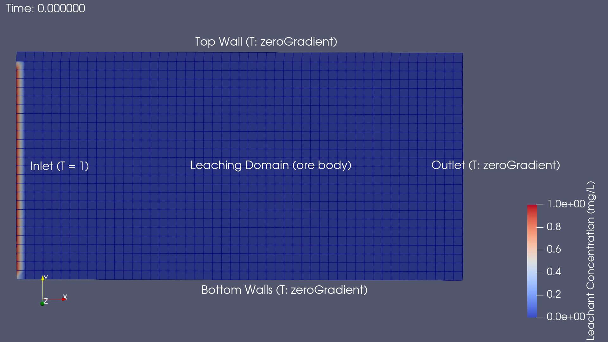

# In-Situ Leaching – First Attempt at CFD with OpenFOAM 12

This project represents my first practical exercise using **OpenFOAM** for computational fluid dynamics (CFD). I selected a simplified **in-situ leaching (ISL)** scenario—an extraction method where a leaching fluid is injected into porous ore to recover valuable minerals without excavation.

Although industrial ISL processes are significantly more complex, this simulation focuses on tracking **scalar transport** of a leaching agent in a 2D flow environment.

## Objectives

- Model the movement and dispersion of a scalar field representing the leachant  
- Utilize OpenFOAM’s **function-based solver** without compiling a custom application  
- Introduce a **coded stopping condition** based on mixing performance (`mixingQuality > 0.9`)  
- Gain practical understanding of OpenFOAM workflows: meshing, initialization, field monitoring, and transient simulation

## Simulation Setup

| Parameter         | Description                          |
|------------------|--------------------------------------|
| **Software**      | OpenFOAM v12                         |
| **Solver**        | `foamRun -solver functions`          |
| **Physics**       | Passive scalar transport             |
| **Domain Size**   | 1 m × 0.5 m × 0.1 m                  |
| **Mesh Resolution** | 50 × 25 × 1                         |
| **Inlet Scalar (T)** | 1.0 (fixed value)                 |
| **Initial Scalar** | 0.0 (uniform)                      |
| **Diffusivity (Dₜ)** | \(1 \times 10^{-5}\) m²/s         |
| **Stopping Criteria** | `mixingQuality > 0.9` (coded object) |

## Governing Equation

This case uses the scalar transport equation:


- : scalar concentration
- : velocity field (assumed steady or user-defined)
- : scalar diffusivity

**T** is used to represent a **leaching agent**, and we’re observing how it enters from the left (inlet), spreads across the domain, and exits through the right (outlet).

## Results Summary

| Time (s) | Mixing Quality |
|----------|----------------|
| 0        | ~0.1           |
| 25       | ~0.56          |
| 50       | ~0.76          |
| 85       | **0.90+** (simulation auto-stopped) |

- The simulation stops automatically once the scalar is sufficiently mixed (based on the coded criterion `mean(T)/max(T) > 0.9`).
- Scalar spread and mixing were visualized in ParaView with both **snapshots** and **animation exports**.

## Visual Output

<p align="center">
  
</p>

<p align="center">
  
</p>

## Real-World Context (vs. Simulation)

| Aspect | Simulated | Real-World |
|--------|-----------|------------|
| Geometry | 2D simple box | Complex geology |
| Flow | Laminar, constant | Multiphase, dynamic |
| Leachant | Scalar field | Chemical solution (acid/base) |
| Monitoring | `mixingQuality` | Concentration from well data |
| Duration | ~100 seconds | Days to months |

## Notes

- OpenFOAM 12 uses `foamRun` and function-based solvers — no need to compile scalarTransportFoam anymore.
- The setup was tricky at first (missing dictionaries, solver errors), but eventually I learned to debug logs and functionObjects.
- Writing a **custom stopping function** gave me a practical introduction to OpenFOAM’s coded functionObjects.
- This project builds a foundation for more advanced setups like **reactive transport** or **porous media modeling**.

## Project Structure

```text
insituLeaching2D/
├── 0/                   # Initial and boundary conditions
├── constant/
│   ├── polyMesh/        # Mesh definition (blockMeshDict)
│   ├── transportProperties
│   └── momentumTransport
├── system/
│   ├── controlDict
│   ├── fvSchemes
│   ├── fvSolution
│   └── functions        # ScalarTransport + coded stop condition
├── log.foamRun          # Output log (redirected)
├── assets               # Screenshots and Animation exported from ParaView
└── README.md            # This file
```

---

## References

1. OpenFOAM v12 Documentation – https://openfoam.org
2. Wolf Dynamics - https://www.wolfdynamics.com/index.php

