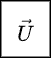

# In-Situ Leaching – First Attempt at CFD with OpenFOAM 12

This project marks my **first practical attempt** at running a CFD simulation using **OpenFOAM**. I chose a simple **in-situ leaching (ISL)** setup — a process used in mining where a fluid is injected into a porous ore body to extract valuable minerals without physically removing the rock.

While the real-world physics are more complex, this case focuses on modeling the **scalar transport** of a leaching agent in a 2D flow — tracking how it diffuses and mixes over time.

---

## 🎯 Simulation Goal

The objective of this beginner simulation is to:

- Model how a scalar (representing a leaching fluid) **moves and spreads** through a 2D domain.
- Use OpenFOAM’s **function-based solver setup** (not a compiled custom solver).
- Implement a **custom-coded stopping condition** based on how well the scalar mixes (`mixingQuality > 0.9`).
- Learn how OpenFOAM handles **mesh setup, field initialization, function objects, and transient runs**.

---

## 🧰 Simulation Setup

| Item | Details |
|------|---------|
| **Software** | OpenFOAM v12 |
| **Solver** | `foamRun -solver functions` with `incompressibleFluid` |
| **Physics** | Passive scalar transport |
| **Domain size** | 1 m × 0.5 m × 0.1 m |
| **Mesh** | 50 × 25 × 1 |
| **Inlet T** | 1.0 (fixed value) |
| **Initial T** | 0.0 (uniform) |
| **Diffusivity** | \( D_T = 1 \times 10^{-5} \) |
| **Stopping Condition** | `mixingQuality > 0.9` (coded functionObject) |

---

## 🔬 What Is Being Simulated?

This case uses the scalar transport equation:


- : scalar concentration
- : velocity field (assumed steady or user-defined)
- : scalar diffusivity

**T** is used to represent a **leaching agent**, and we’re observing how it enters from the left (inlet), spreads across the domain, and exits through the right (outlet).

---

## 📊 Results Summary

| Time (s) | Mixing Quality |
|----------|----------------|
| 0        | ~0.1           |
| 25       | ~0.56          |
| 50       | ~0.76          |
| 85       | **0.90+** ✅ simulation auto-stopped |

- The simulation stops automatically once the scalar is sufficiently mixed (based on the coded criterion `mean(T)/max(T) > 0.9`).
- Scalar spread and mixing were visualized in ParaView with both **snapshots** and **animation exports**.

---

## 📸 Visual Output

<p align="center">
  
</p>

<p align="center">
  
</p>

---

## 🌍 Real-World Context (vs. Simulation)

| Aspect | Simulated | Real-World |
|--------|-----------|------------|
| Geometry | 2D simple box | Complex geology |
| Flow | Laminar, constant | Multiphase, dynamic |
| Leachant | Scalar field | Chemical solution (acid/base) |
| Monitoring | `mixingQuality` | Concentration from well data |
| Duration | ~100 seconds | Days to months |

---

## 🧠 Reflections & Learning Points

- OpenFOAM 12 uses `foamRun` and function-based solvers — no need to compile scalarTransportFoam anymore.
- The setup was tricky at first (missing dictionaries, solver errors), but eventually I learned to debug logs and functionObjects.
- Writing a **custom stopping function** gave me a practical introduction to OpenFOAM’s coded functionObjects.
- This project builds a foundation for more advanced setups like **reactive transport** or **porous media modeling**.

---

## 📁 Project Structure

```text
insituLeaching2D/
├── 0/                   # Initial and boundary conditions
├── constant/
│   ├── polyMesh/        # Mesh definition (blockMeshDict)
│   ├── transportProperties
│   └── momentumTransport
├── system/
│   ├── controlDict
│   ├── fvSchemes
│   ├── fvSolution
│   └── functions        # ScalarTransport + coded stop condition
├── log.foamRun          # Output log (redirected)
├── assets               # Screenshots and Animation exported from ParaView
└── README.md            # This file
```

---

## 📚 References

1. OpenFOAM v12 Documentation – https://openfoam.org
2. Wolf Dynamics - https://www.wolfdynamics.com/index.php

---

> Feel free to fork, modify, or extend the case for your own research or teaching purposes.
